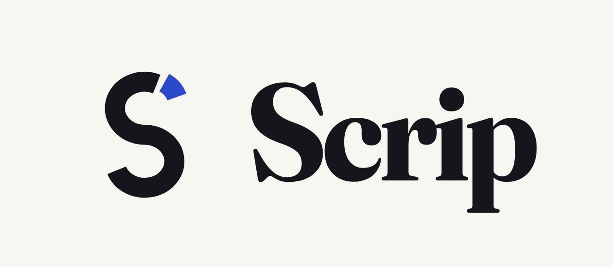

<p align="center"></p>

# Scrip

**Scrip is where income becomes ownership.**

> **Live on Solana mainnet since 21 September 2026 — [scrip.work](https://scrip.work)**
>
> | | |
> | --- | --- |
> | Program | [`Fbp8fBdCnT8Pv1g5vJ8brPZm1U4yWLtUsEtoac8A16gj`](https://solscan.io/account/Fbp8fBdCnT8Pv1g5vJ8brPZm1U4yWLtUsEtoac8A16gj) |
> | Build | 585,384 bytes, sha256 `92f9cbda1fee08a796e0273478bb660f00ccec31c4c6632b5cbf23efa15b8d7a` |
> | Verify it yourself | `solana program dump Fbp8fBdCnT8Pv1g5vJ8brPZm1U4yWLtUsEtoac8A16gj out.so` reproduces that hash from the chain |
> | Registers | [@scrip](https://scrip.work/@scrip) (an organisation), [@shariq](https://scrip.work/@shariq), [@yusih](https://scrip.work/@yusih) |
> | Everything settled | [scrip.work/ledger](https://scrip.work/ledger) · [the keepers](https://scrip.work/keepers) |
>
> A real receipt, openable by a stranger with no wallet and no account:
> **[$25.05 landed · 10% became 0.0032 SPYx](https://scrip.work/receipt/3ZEDeZLWUqTLgMe77QmEfy3DfZBVHT5rWE8mDNhbfqo2FqP9EFAgxzjdCRYs2a3JLd4wcoJW2sNfVuPJAC7WqmVn)**

Since the first stock exchange, being paid in ownership was for employees of public
companies with brokerage accounts. A stock was a certificate a company issued to insiders,
then a line in a broker's database, and in both cases something you had to go somewhere to
buy, in the hours somebody else kept. On Solana a stock is a token, and a token can be paid,
ruled, given, vested and remembered like money. That is the whole idea.

**You're already getting paid. Investing shouldn't take another decision.**

## The seven firsts

Each of these is something a stock could not do before it was a token on Solana, and each is
a surface in this repository, not a claim.

| | A stock can | Where it happens | On mainnet |
| --- | --- | --- | --- |
| 01 | be paid | `/app/org/pay` — an organisation pays a person in stock, one signature | [`NFZucZvh…`](https://solscan.io/tx/NFZucZvh5QJAeid7WNxZECeUxuMsJgRUbFxyn57gCxmBmym5C1cP4X3yvnERN4JShde9PxLodVcohYawq3gVcza) |
| 02 | obey a rule on an address | `/app/rule` — a slice of every arrival becomes stock | [`3ZEDeZLW…`](https://solscan.io/tx/3ZEDeZLWUqTLgMe77QmEfy3DfZBVHT5rWE8mDNhbfqo2FqP9EFAgxzjdCRYs2a3JLd4wcoJW2sNfVuPJAC7WqmVn) |
| 03 | remember why it arrived | `/receipt/<sig>` — the reason is hashed onto the receipt | [`NFZucZvh…`](https://scrip.work/receipt/NFZucZvh5QJAeid7WNxZECeUxuMsJgRUbFxyn57gCxmBmym5C1cP4X3yvnERN4JShde9PxLodVcohYawq3gVcza) |
| 04 | vest from anyone to anyone | `/grant/<pda>` — an escrow the payer cannot spend, released by keepers | in the mainnet program; the first mainnet grant is not opened yet |
| 05 | arrive before the opening bell | `/floor` — the share of arrivals that settled while the NYSE was shut | most have: [`5h9QtobT…`](https://solscan.io/tx/5h9QtobTeBzNhvVzpPdL6MNLVRco6DJUx95L2HSmy6XQnbjTwGexXSPn3Q6E6vSNt1us4FxGuMCACfghNPdT5VnY) settled at 06:04 ET; the floor counts them live |
| 06 | be given to an empty wallet | `/claim/<payer>/<id>` — a relayer pays the fee | [`3tbreDda…`](https://solscan.io/tx/3tbreDdapAgVF7XdXGzucBiSAFK75x1xgHsALj2NVLcVRscX19J1x4J9LxZijTsh2337FRoRvWgjtWLmcMBan9vL) |
| 07 | prove it was kept | `/ledger` — keep-rate measured on chain at 7 and 30 days | first marks 28 Sep 2026 |

Every one is exercised by the on-chain battery (`npm run test:devnet`). The mainnet column is
filled only where a real transaction exists: 04 waits for the first grant on mainnet, and 07
for 28 September, when the first receipt's 7-day window closes. 06 is the one worth opening —
a wallet holding **zero SOL** opened a register and took a stock position in a single
transaction, because the fee was sponsored.

A person paid in stablecoins on Solana — a freelancer, a contractor, a grant recipient, a
bounty earner — can receive USDC from anyone, anywhere, at any hour, and cannot own the
S&P 500 without a brokerage most of them cannot open and a decision they never make. USDC
that arrives is spent or goes back into crypto. Every product around tokenized stocks is a
venue for people who already decided to invest.

**Scrip is a rule on your wallet.** Set a rate once on the Solana address you already use;
a slice of every USDC that lands becomes S&P 500 in the same wallet, with a permanent
receipt and a keep-rate measured on chain at 7 and 30 days. Non-custodial: pausing is a
token-program `revoke`. Payers keep sending dollars.

**And the other side of the same program: get paid in ownership.** An organisation pays one
person, a whole team from a file, or a grant that vests, in stock, with one signature; every
line is a receipt anyone can open, with its reason; a grant sits in an escrow the payer
cannot spend and vests by keepers. Scrip is the first organisation on it: its bounties are
paid in stock through `@scrip`. The plan is `docs/SCRIP-COMPANY-PLAN.md`.

```bash
npm install && npm run dev
```

## What runs today

| | |
| --- | --- |
| **Program** | `Fbp8fBdCnT8Pv1g5vJ8brPZm1U4yWLtUsEtoac8A16gj` on **Solana mainnet** since 21 September 2026 (and on devnet, for the test battery). Anchor 0.31.1, upgradeable by one key until a multisig |
| **Instructions** | `open_book` · `set_asset` · `close_book` · `enable_rule` · `set_rule` · `disable_rule` · `sync_watermark` · `withdraw_float` · `begin_sweep` · `finish_sweep` · `fund_payout` · `release_payout` · `claim_payout` · `cancel_payout` · `open_grant` · `seal_grant` · `vest` · `revoke_grant` · `close_grant` · `measure_receipt` |
| **Assets** | SPYx (default), QQQx, Oro GOLD, and eleven single-name xStocks — every mint read off mainnet, issuer powers on every row |
| **Prices** | Pyth, on chain, fully verified, under ten minutes old, confidence under 1% — enforced by the program. SPYx settles against `Equity.US.SPY/USD`, which is published on weekdays, before the bell too; when no price can be verified, at a weekend, an arrival waits in the wallet and the page says so |
| **Routing** | Jupiter, as top-level instructions the program makes atomic without a CPI |
| **Keepers** | two, on different keys, racing for every sweep — [scrip.work/keepers](https://scrip.work/keepers) |
| **Tests** | the offline suite; 43 Rust unit tests; a live registry battery against mainnet; a 20-test on-chain battery, on devnet or a local validator with Pyth's accounts cloned |

## Try it in a minute

1. **Open a receipt — no wallet, no account.** [$25.05 landed · 10% became 0.0032 SPYx](https://scrip.work/receipt/3ZEDeZLWUqTLgMe77QmEfy3DfZBVHT5rWE8mDNhbfqo2FqP9EFAgxzjdCRYs2a3JLd4wcoJW2sNfVuPJAC7WqmVn).
   The Pyth price it settled against, that price's age and band, and the 7- and 30-day checks
   are all read from the chain.
2. **Watch money become stock.** The front door of [scrip.work](https://scrip.work) is `@scrip`'s
   own register, live. Scan its Solana Pay code with any wallet and send $5 of USDC: when a
   price can be verified, the stub prints within seconds; when none can, it says so and
   waits. The $5 stays with `@scrip`.
3. **Turn it on for your own wallet.** [scrip.work/app/rule](https://scrip.work/app/rule): one
   question, one signature, about 0.024 SOL — most of it prepaid receipts you can withdraw.
   Not offered to US persons.

## Run it yourself

The whole moment on devnet, on the deployed program, with stand-in mints and a transfer
standing in for the route — the price is real Pyth:

```bash
npm run demo:devnet -- setup      # two mints, a book at @demo, the rule on at 10%, one signature
npm run demo:devnet -- land 200   # $200 lands in the owner's USDC account: the ghost stub appears
npm run demo:devnet -- sweep      # the keeper sweeps it, verified against Pyth SOL/USD: the stub prints
npm run demo:devnet -- status
```

Sign in at `/app` as the demo owner (`demo:devnet -- sign <nonce> <issuedAt>` signs the
sign-in message; a wallet does the same with one click), or watch the front door without
signing in at all. The on-chain battery (`npm run test:devnet`) runs every path the same way.
`docs/deploy.md` is the mainnet runbook: host, RPC, keys, the program, the keeper, and the
front wallet anyone can pay from the front door.

The mainnet deploy cost **2.978549209 SOL**, measured: 2.97 of it is the program's rent
deposit, which comes back if the program is ever closed, and the buffer is not a second
deposit. The keeper reads Pyth's accounts on chain; a Pyth API key is only a fallback.
`npm run preflight -- --mainnet` reads the chain and prints exactly what is missing;
`NEXT_PUBLIC_SOLANA_CLUSTER` is the only switch.

## How the rule sees money

The rule watches your USDC associated token account. When you turn it on, the current
balance becomes the **watermark**. A sweep reads the balance, subtracts the watermark, and
calls the difference the inflow; the slice is the rate applied to that, bounded by the cap
and never below the floor; the watermark becomes the balance after the slice left. **Net,
not gross**: if the balance fell, the watermark follows it down, and money spent before a
keeper acts is not taxed. Swap proceeds count. `docs/how-the-rule-sees-money` on the site.

## What a keeper can and cannot do

- cannot choose the amount: the program computes the slice from on-chain state
- cannot omit the check: `begin_sweep` refuses unless a `finish_sweep` for the same book and release follows in the same transaction
- must deliver the minimum: the owner's own token account, read before and after, must gain at least the slice's worth at Pyth's price net of confidence, less the owner's tolerance (1% by default)
- **may keep what it does not deliver**: the program checks that minimum, not the whole slice, so a keeper that delivers only the minimum keeps the difference — about the tolerance plus Pyth's band, plus any move in the ten minutes a price stays valid. Scrip's own keepers swap the whole slice into the owner's account (the first two sweeps filled 0.04% above and 0.12% below Pyth). Requiring every keeper to is the first change in the next program upgrade
- is paid a fixed tip of 0.0005 SOL plus the rent it advanced, from the owner's float

## Atomic without a Jupiter CPI

A PDA can only sign inside a CPI, so a top-level Jupiter instruction cannot draw from a
program-owned escrow. The slice passes through the keeper's own USDC account inside one
transaction, and the program guarantees — by reading the instructions sysvar, the pattern
flash-loan programs use — that the verifying instruction runs at the end. `finish_sweep`
checks the owner's cash is unchanged, reads a fully verified Pyth price for one of the
book's two feeds, converts the minimum through the mint's **live** scaled-UI multiplier when
the feed prices a share, and requires the delta on the owner's account to clear it.
Otherwise everything reverts, delegate transfer included.

## Keep-rate

Recorded at settlement, measured on chain at 7 and 30 days by anyone who calls
`measure_receipt`, computed from raw units so a rebase never looks like a sale. Per
recipient and asset: `held = min(balance_raw_at_measure, Σ amount_raw)`, weighted by the
dollars on each receipt. A window that has not matured states its date; a matured receipt
nobody measured is excluded and reported, never counted as spent.

## Engineering notes

- **The live multiplier is not the field named `multiplier`.** A Token-2022 ScaledUiAmount
  config carries two values and a timestamp; the newer takes over when its timestamp
  passes. On SPYx that was three months in the past, so the obvious read is 0.18% short,
  forever. Read across fourteen mints on 2026-09-15, activations fell at 23:55, 00:30 and
  04:00 UTC: nothing here assumes an hour. `anchor/programs/scrip/src/scaled_ui.rs`,
  parsed by hand because the crate this Anchor pins predates the extension.
- **Pyth feeds are not one thing.** `Crypto.SPYX/USD` prices the raw token and is
  published around the clock; `Equity.US.SPY/USD` prices a share in market hours. The Book
  carries both feed ids and the program applies the multiplier only for the second. The
  on-chain SPYX account measured 65 hours stale on 2026-09-15; the keeper posts its own.
- **Stack frames are 4 KiB.** Contexts with a dozen deserialized accounts overflowed one
  and produced garbage pointers on devnet; every heavy account is boxed.
- **Anchor's Borsh coder encodes a zero for a field name it cannot find.** Every
  instruction builder round-trips its arguments in a test.
- **The indexer walks pages** with `before` until a page is short, then processes oldest
  first, so a second run adds rows; the predecessor stopped after one page.

## The organisation side

```
/app/org/pay      one person: a handle or an address, an amount, a reason, an optional split
/app/org/runs     a run: a CSV of handle, amount, reason; one signature; every line a receipt sharing a run id
/app/org/grants   a grant: bought once into an escrow, vesting on a schedule, released by keepers
/@org             the public page: pays in stock since, people paid, runs, grants vesting
/run/<id>         every line of a run, with its reason
/grant/<pda>      a grant and what has vested
/floor            every stub as it prints, the world over
```

## Not built

Mixes (several assets per book), round-ups on outbound payments, the embedded-wallet door,
Backpack mint-and-redeem as a second fill venue, cross-chain arrivals, yield, credit,
milestones and share cards for a person's firsts. Each is one more destination for the same
standing instruction.

## The moat, before a judge says it

A wallet could ship this. What it would not have: receipts anyone can open, a keep-rate
measured on chain, permissionless keepers, correct corporate-action accounting, and real
wallets first. Zero fee in v1; then basis points on the slice.

## Where things are

| File | What it holds |
| --- | --- |
| `CLAUDE.md` | the short spec, the architecture, the standing policies, the drift log |
| `docs/scrip.md` | the complete product |
| `docs/SCRIP-COMPANY-PLAN.md` | the company: get paid in ownership, the floor, the order by leverage |
| `docs/current-state.md` | what exists and what it does when you run it, observed |
| `docs/deploy.md` | the runbook: the VM, the devnet redeploy, a local validator, mainnet |
| `docs/decisions.md` | what was locked and why |
| `anchor/programs/scrip/` | the program |
| `src/lib/assets/registry.ts` | every asset, read off mainnet |
| `src/keeper/` | the keeper |
| `src/styles/tokens.css` · `.claude/skills/scrip-ui/` | the design system |

## Open source

MIT — see [`LICENSE`](LICENSE). Everything in this repository was written for Scrip; it stands
on these open-source projects, used as published: [Anchor](https://github.com/solana-foundation/anchor),
[`@solana/web3.js`](https://github.com/solana-foundation/solana-web3.js) and `@solana/spl-token`,
Pyth's [`pyth-solana-receiver`](https://github.com/pyth-network/pyth-crosschain) and Hermes client,
the Wallet Standard, [Next.js](https://github.com/vercel/next.js) and React, drizzle-orm and
better-sqlite3, zod, and Vitest. Routes come from Jupiter's public API, which is a service,
not a dependency in this repository.

## Honesty, before you ask

- **Not our custody.** Your USDC and your stock sit in token accounts you own. The program
  holds a rule and writes receipts.
- **The issuer can move these tokens.** Every xStock carries a permanent delegate and a
  pause authority. Not offered to US persons; the owner attests eligibility.
- **Dividends are reinvested, not paid.** There is no equity income on chain.
- **Net, not gross.** The rule sees the net increase since the last sweep.
- **Savings-grade, not stable.** Equities fall as well as rise.
- **A keeper is held to a minimum, not to the whole slice** — see what a keeper can do,
  above. The tolerance you set is also the most a keeper other than Scrip's could keep.
- **The program is upgradeable** by the deployer key until a multisig.
