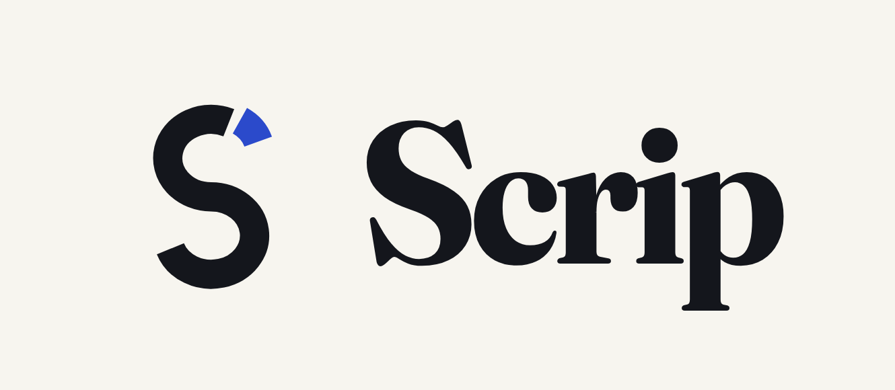
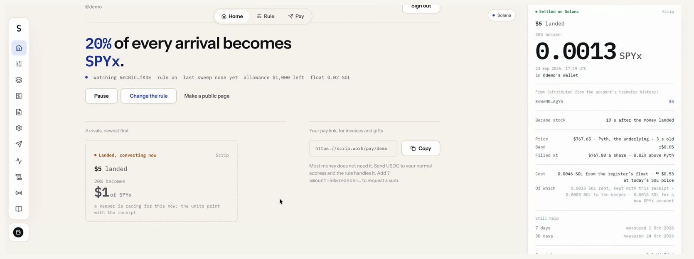

<p align="center"></p>

# Scrip

**Save part of every dollar you're paid into stocks you own. Whoever pays you can match it.**

> **Live on Solana mainnet since 21 September 2026 — [scrip.work](https://scrip.work)**
>
> | | |
> | --- | --- |
> | Program | [`Fbp8fBdCnT8Pv1g5vJ8brPZm1U4yWLtUsEtoac8A16gj`](https://solscan.io/account/Fbp8fBdCnT8Pv1g5vJ8brPZm1U4yWLtUsEtoac8A16gj) |
> | Build | 617,552 bytes, sha256 `fca62b7977b2af359cfee4544ed23dd6c293550ccd7f60b245da16cd4036d76c`, upgraded on 2026-10-08 at slot 454,396,444 to add Plans (was 585,384 bytes, `92f9cbda…`) |
> | Verify it yourself | `solana program dump Fbp8fBdCnT8Pv1g5vJ8brPZm1U4yWLtUsEtoac8A16gj out.so` reproduces that hash from the chain |
> | Everything settled | [scrip.work/ledger](https://scrip.work/ledger) — every receipt, and how much of it is still held |
>
> Real receipts, openable by a stranger with no wallet and no account:
>
> - **Every payment:** [$5 landed · 20% became 0.0013 S&P 500, 10 seconds later, filled 0.02% from Pyth](https://scrip.work/receipt/5NcgNf2SXzEQiwXEf6bzcLtirk4JmHE3vx2Qan2uh41LHJFvFXs8SLiRNkwUCAKEKV7bqhBfUDJ92rRj7i6koicG)
> - **The match:** [$20 landed · 20% became 0.0053 Nasdaq 100](https://scrip.work/receipt/5YrDMN5kMJmew3gAffLNCLiqEHeYzMH7zdsvqgxoUBvdkKXH9iaYXVZbxXfwcWnbKSigs3xrqQrYXjCBDc1ULPa9), and [ten seconds after it, the sponsor's Plan added $2 of Nasdaq 100](https://solscan.io/tx/33wcVSx4NiJxE2Ne9JuAki26zcqo1XAFoESygbmc9AQkygGFzBkaZqp272x3hAuhYH28Ucvwk4P31epXBt3ug5r4), paid by the program in its own transaction
> - **Pay in stock:** [an organisation paid a person in stock, with the reason on the receipt](https://scrip.work/receipt/NFZucZvh5QJAeid7WNxZECeUxuMsJgRUbFxyn57gCxmBmym5C1cP4X3yvnERN4JShde9PxLodVcohYawq3gVcza)
>
> Every receipt so far is to the team's own wallets, and every surface says so; `/ledger` counts the people outside the team separately.

<p align="center"></p>

**You're already getting paid. Investing shouldn't take another decision.**

A person paid in stablecoins on Solana — a freelancer, a contractor, a grant recipient, a bounty
earner — can receive USDC from anyone, anywhere, at any hour, and cannot own the Nasdaq 100 without
a brokerage most of them cannot open and a decision they never make. USDC that arrives is spent or
goes back into crypto. Every product around tokenized stocks is a venue for people who already
decided to invest. Scrip is for the people who never will decide, so it asks once.

## How it works, in one minute

1. **Start saving.** Open [scrip.work](https://scrip.work) in your Solana wallet. One question —
   how much of every payment becomes stock (10% by default) — one stock (the Nasdaq 100 by
   default), and one approval. That approval makes a first save now, so stock lands in the wallet
   the same minute, and turns on saving every payment. Scrip can move at most $200 of your USDC,
   only into that stock; stopping is one token-program instruction the program cannot block.
2. **Every payment.** Whoever pays you keeps sending USDC to the address you already use. Within
   seconds of an arrival, the slice becomes stock in the same wallet, checked on chain against a
   Pyth price, with a permanent receipt anyone can open. The rest stays USDC, untouched.
3. **Get matched.** Whoever pays you can open a **Plan**: for every automatic save one of its
   people makes, the program adds a share in stock, capped each month, in its own transaction,
   never taken back. Live on mainnet since 8 October.

Saving once, without the automatic part, is a plain Jupiter swap into any of 98 tokenized stocks
(xStocks, Ondo, Backpack), with a receipt read from the transaction:
[scrip.work/app/save](https://scrip.work/app/save). It works at any hour.

## The seven firsts

Each of these is something a stock could not do before it was a token on Solana, and each is
a surface in this repository, not a claim.

| | A stock can | Where it happens | On mainnet |
| --- | --- | --- | --- |
| 01 | be paid | `/app/org/pay` — an organisation pays a person in stock, one signature | [`NFZucZvh…`](https://solscan.io/tx/NFZucZvh5QJAeid7WNxZECeUxuMsJgRUbFxyn57gCxmBmym5C1cP4X3yvnERN4JShde9PxLodVcohYawq3gVcza) |
| 02 | obey a rule on an address | `/app/rule` — a slice of every arrival becomes stock | [`3ZEDeZLW…`](https://solscan.io/tx/3ZEDeZLWUqTLgMe77QmEfy3DfZBVHT5rWE8mDNhbfqo2FqP9EFAgxzjdCRYs2a3JLd4wcoJW2sNfVuPJAC7WqmVn) |
| 03 | remember why it arrived | `/receipt/<sig>` — the reason is hashed onto the receipt | [`NFZucZvh…`](https://scrip.work/receipt/NFZucZvh5QJAeid7WNxZECeUxuMsJgRUbFxyn57gCxmBmym5C1cP4X3yvnERN4JShde9PxLodVcohYawq3gVcza) |
| 04 | vest from anyone to anyone | `/grant/<pda>` — an escrow the payer cannot spend, released on its own every day | in the mainnet program; the first mainnet grant is not opened yet |
| 05 | arrive before the opening bell | `/floor` — the share of arrivals that settled while the NYSE was shut | most have: [`5h9QtobT…`](https://solscan.io/tx/5h9QtobTeBzNhvVzpPdL6MNLVRco6DJUx95L2HSmy6XQnbjTwGexXSPn3Q6E6vSNt1us4FxGuMCACfghNPdT5VnY) settled at 06:04 ET; the floor counts them live |
| 06 | be given | `/claim/<payer>/<id>` — the recipient claims it into their own wallet | [`3tbreDda…`](https://solscan.io/tx/3tbreDdapAgVF7XdXGzucBiSAFK75x1xgHsALj2NVLcVRscX19J1x4J9LxZijTsh2337FRoRvWgjtWLmcMBan9vL) |
| 07 | prove it was kept | `/ledger` — keep-rate measured on chain at 7 and 30 days | measured since 28 Sep 2026 |

Every one is exercised by the on-chain battery (`npm run test:devnet`). The mainnet column is
filled only where a real transaction exists: 04 waits for the first grant on mainnet; 07's first
7-day marks were written on 28 September. 06 is the one worth opening: a wallet that had never
held a stock opened its savings record and took its first position in a single transaction. That first claim was sponsored; since 24 September every claim is the claimer's
own — one signature, under 0.009 SOL, most of it rent for accounts that stay theirs.

**The other side of the same program: pay in ownership.** An organisation pays one person, a whole
team from a file, or a grant that vests, in stock, with one signature; every line is a receipt
anyone can open, with its reason; a grant sits in an escrow the payer cannot spend and vests on its
own. And a team can match what its people save with a Plan.

```bash
npm install && npm run dev
```

## What runs today

| | |
| --- | --- |
| **Program** | `Fbp8fBdCnT8Pv1g5vJ8brPZm1U4yWLtUsEtoac8A16gj` on **Solana mainnet** since 21 September 2026 (and on devnet, for the test battery). Anchor 0.31.1, upgradeable by one key until a multisig |
| **Instructions** | `open_book` · `set_asset` · `close_book` · `enable_rule` · `set_rule` · `disable_rule` · `sync_watermark` · `withdraw_float` · `begin_sweep` · `finish_sweep` · `fund_payout` · `release_payout` · `claim_payout` · `cancel_payout` · `open_grant` · `seal_grant` · `vest` · `revoke_grant` · `close_grant` · `measure_receipt`, and since 8 October the Plans: `open_plan` · `add_member` · `accept_member` · `remove_member` · `match_receipt` · `close_plan` |
| **Assets** | Every payment saves into one of the eleven stocks a price can be verified for on Solana: the Nasdaq 100 (QQQx, the default), the S&P 500 (SPYx), Oro GOLD and single-name xStocks. Saving once reaches 98 tokenized stocks from three issuers, each with a route Jupiter quotes. Every mint read off mainnet, issuer powers on every row |
| **Prices** | Pyth, on chain, fully verified, under ten minutes old, confidence under 1% — enforced by the program. Pyth stopped pushing equity prices on chain around 28 September; Scrip's servers now post a fully verified update themselves when a save needs one, from a Pyth API key entitled today to the Nasdaq 100, Tesla, gold and USDC (a trial that runs to about 21 October). When no price can be verified — at a weekend, or for a stock the key does not cover — an arrival waits in the wallet as USDC and the page says so. Saving once needs no oracle |
| **Routing** | Jupiter, as top-level instructions the program makes atomic without a CPI |
| **Automatic saving** | Scrip saves within seconds of a payment; every save is one transaction the program verifies, or nothing moves |
| **Tests** | the offline suite; 43 Rust unit tests; a live registry battery against mainnet; a 20-test on-chain battery, on devnet or a local validator with Pyth's accounts cloned |

## Try it in a minute

1. **Open a receipt — no wallet, no account.** [$5 landed · 20% became 0.0013 S&P 500](https://scrip.work/receipt/5NcgNf2SXzEQiwXEf6bzcLtirk4JmHE3vx2Qan2uh41LHJFvFXs8SLiRNkwUCAKEKV7bqhBfUDJ92rRj7i6koicG):
   the stock arrived 10 seconds after the money, filled 0.02% from the Pyth price it was
   checked against. The price's age and band, the cost, and the 7- and 30-day checks are all
   read from the chain.
2. **Start saving in your own wallet.** Open [scrip.work](https://scrip.work) in Phantom,
   Solflare or Backpack: one card, one approval, and a first save lands in seconds, at any hour.
   Starting sets aside about 0.026 SOL, most of it deposits that come back and prepaid fees for
   your next automatic saves. Not offered to US persons.
3. **See the match.** [The sponsor's Plan adding $2 of Nasdaq 100](https://solscan.io/tx/33wcVSx4NiJxE2Ne9JuAki26zcqo1XAFoESygbmc9AQkygGFzBkaZqp272x3hAuhYH28Ucvwk4P31epXBt3ug5r4)
   ten seconds after a member's automatic save: the escrow, the cap and the share are all the
   program's.

## Films

[The film, 1:36](https://youtu.be/snAm1xOh_Pk) and [how a sweep works, 1:52](https://youtu.be/YbZeUL4TZj4),
recorded on 24–25 September 2026, before the start card and Plans: they show the earlier screens
("turn on the rule", the S&P 500 by default). The mechanism they show is unchanged.

## Run it yourself

The whole moment on devnet, on the deployed program, with stand-in mints and a transfer
standing in for the route — the price is real Pyth:

```bash
npm run demo:devnet -- setup      # two mints, a book at @demo, the rule on at 10%, one signature
npm run demo:devnet -- land 200   # $200 lands in the owner's USDC account: the ghost stub appears
npm run demo:devnet -- sweep      # Scrip saves it, verified against Pyth SOL/USD: the stub prints
npm run demo:devnet -- status
```

Sign in at `/app` as the demo owner (`demo:devnet -- sign <nonce> <issuedAt>` signs the
sign-in message; a wallet does the same with one click), or watch the front door without
signing in at all. The on-chain battery (`npm run test:devnet`) runs every path the same way.
`docs/deploy.md` is the mainnet runbook: host, RPC, keys, the program, the saving service, and the
front wallet anyone can pay from the front door.

The mainnet deploy cost **2.978549209 SOL**, measured: 2.97 of it is the program's rent
deposit, which comes back if the program is ever closed, and the buffer is not a second
deposit. Scrip reads Pyth's accounts on chain; a Pyth API key is only a fallback.
`npm run preflight -- --mainnet` reads the chain and prints exactly what is missing;
`NEXT_PUBLIC_SOLANA_CLUSTER` is the only switch.

## How the rule sees money

The rule watches your USDC associated token account. When you turn it on, the current
balance becomes the **watermark**. A sweep reads the balance, subtracts the watermark, and
calls the difference the inflow; the slice is the rate applied to that, bounded by the cap
and never below the floor; the watermark becomes the balance after the slice left. **Net,
not gross**: if the balance fell, the watermark follows it down, and money spent before it
is saved is not counted. Swap proceeds count. `docs/how-the-rule-sees-money` on the site.

## What Scrip's servers can and cannot do

Scrip's servers submit every automatic save and every vest. The program checks each one, so
they are trusted for very little:

- cannot choose the amount: the program computes the slice from on-chain state
- cannot omit the check: `begin_sweep` refuses unless a `finish_sweep` for the same book and release follows in the same transaction
- must deliver the minimum: the owner's own token account, read before and after, must gain at least the slice's worth at Pyth's price net of confidence, less the owner's tolerance (1% by default)
- **are trusted for the rest of the slice, for now**: the program checks that minimum, not the whole slice, so a submitter that delivered only the minimum could keep the difference — about the tolerance plus Pyth's band, plus any move in the ten minutes a price stays valid. Scrip's servers swap the whole slice into the owner's account (the first two sweeps filled 0.04% above and 0.12% below Pyth). Requiring that on chain is the first change in the next program upgrade
- are paid a fixed fee for submitting each save, plus the rent they advanced, from the owner's prepaid saves

## Atomic without a Jupiter CPI

A PDA can only sign inside a CPI, so a top-level Jupiter instruction cannot draw from a
program-owned escrow. The slice passes through the submitting server's own USDC account inside one
transaction, and the program guarantees — by reading the instructions sysvar, the pattern
flash-loan programs use — that the verifying instruction runs at the end. `finish_sweep`
checks the owner's cash is unchanged, reads a fully verified Pyth price for one of the
book's two feeds, converts the minimum through the mint's **live** scaled-UI multiplier when
the feed prices a share, and requires the delta on the owner's account to clear it.
Otherwise everything reverts, delegate transfer included.

## Keep-rate

Recorded at settlement, measured on chain at 7 and 30 days by anyone who calls
`measure_receipt`, computed from raw units so a rebase never looks like a sale. Per
recipient and asset: `held = min(balance_raw_at_measure, Σ amount_raw)`, weighted by the
dollars on each receipt. A window that has not matured states its date; a matured receipt
nobody measured is excluded and reported, never counted as spent.

## Engineering notes

- **The live multiplier is not the field named `multiplier`.** A Token-2022 ScaledUiAmount
  config carries two values and a timestamp; the newer takes over when its timestamp
  passes. On SPYx that was three months in the past, so the obvious read is 0.18% short,
  forever. Read across fourteen mints on 2026-09-15, activations fell at 23:55, 00:30 and
  04:00 UTC: nothing here assumes an hour. `anchor/programs/scrip/src/scaled_ui.rs`,
  parsed by hand because the crate this Anchor pins predates the extension.
- **Pyth feeds are not one thing.** `Crypto.SPYX/USD` prices the raw token and is
  published around the clock; `Equity.US.SPY/USD` prices a share in market hours. The Book
  carries both feed ids and the program applies the multiplier only for the second. The
  on-chain SPYX account measured 65 hours stale on 2026-09-15; Scrip posts its own.
- **Stack frames are 4 KiB.** Contexts with a dozen deserialized accounts overflowed one
  and produced garbage pointers on devnet; every heavy account is boxed.
- **Anchor's Borsh coder encodes a zero for a field name it cannot find.** Every
  instruction builder round-trips its arguments in a test.
- **The indexer walks pages** with `before` until a page is short, then processes oldest
  first, so a second run adds rows; the predecessor stopped after one page.

## The organisation side

```
/app/org/plans    a Plan: match a share of every automatic save your people make, capped each month
/app/org/pay      one person: a handle or an address, an amount, a reason, an optional split
/app/org/runs     a run: a CSV of handle, amount, reason; one signature; every line a receipt sharing a run id
/app/org/grants   a grant: bought once into an escrow, vesting on a schedule, released on its own every day
/@org             the public page: pays in stock since, people paid, runs, grants vesting
/run/<id>         every line of a run, with its reason
/grant/<pda>      a grant and what has vested
/floor            every stub as it prints, the world over
```

## Not built

The whole slice enforced on chain (today the program enforces the Pyth-bounded minimum; see
below), a second oracle for the hours and stocks Pyth's key does not cover, receipts that can be
closed after their 30-day measurement, a multisig upgrade authority, network fees paid from USDC,
mixes (several assets per rule), round-ups on outbound payments, and cross-chain arrivals.

## The moat, before a judge says it

A wallet could ship this. What it would not have: receipts anyone can open, a keep-rate
measured on chain, automatic saves the program verifies one by one, correct corporate-action accounting, and real
wallets first. Zero fee in v1; then basis points on the slice.

## Where things are

| File | What it holds |
| --- | --- |
| `CLAUDE.md` | the short spec, the architecture, the standing policies, the drift log |
| `docs/scrip.md` | the complete product |
| `docs/SCRIP-COMPANY-PLAN.md` | the company: get paid in ownership, the floor, the order by leverage |
| `docs/current-state.md` | what exists and what it does when you run it, observed |
| `docs/deploy.md` | the runbook: the VM, the devnet redeploy, a local validator, mainnet |
| `docs/decisions.md` | what was locked and why |
| `anchor/programs/scrip/` | the program |
| `src/lib/assets/registry.ts` | every asset, read off mainnet |
| `src/keeper/` | the saving service: watches arrivals, posts prices, submits saves and vests |
| `src/styles/tokens.css` · `.claude/skills/scrip-ui/` | the design system |

## Open source

MIT — see [`LICENSE`](LICENSE). Everything in this repository was written for Scrip; it stands
on these open-source projects, used as published: [Anchor](https://github.com/solana-foundation/anchor),
[`@solana/web3.js`](https://github.com/solana-foundation/solana-web3.js) and `@solana/spl-token`,
Pyth's [`pyth-solana-receiver`](https://github.com/pyth-network/pyth-crosschain) and Hermes client,
the Wallet Standard, [Next.js](https://github.com/vercel/next.js) and React, drizzle-orm and
better-sqlite3, zod, and Vitest. Routes come from Jupiter's public API, which is a service,
not a dependency in this repository.

## Honesty, before you ask

- **Not our custody.** Your USDC and your stock sit in token accounts you own. The program
  holds a rule and writes receipts.
- **The issuer can move these tokens.** Every xStock carries a permanent delegate and a
  pause authority. Not offered to US persons; the owner attests eligibility.
- **Dividends are reinvested, not paid.** There is no equity income on chain.
- **Net, not gross.** The rule sees the net increase since the last sweep.
- **Savings-grade, not stable.** Equities fall as well as rise.
- **A save is held to a minimum, not to the whole slice** — see what Scrip's servers can do,
  above. The tolerance you set is also the most anyone submitting a save could keep.
- **The program is upgradeable** by the deployer key until a multisig.
